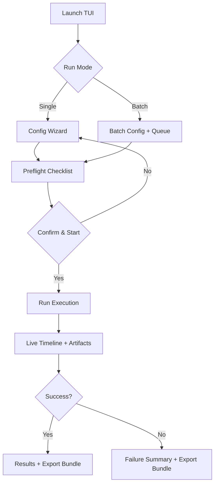
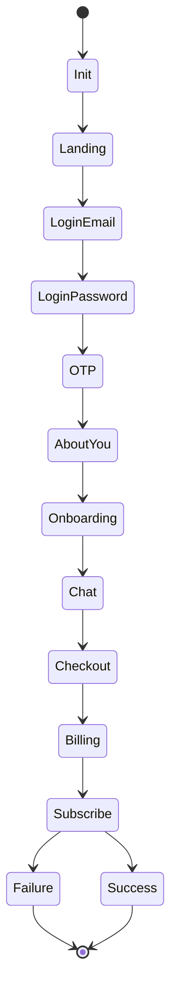
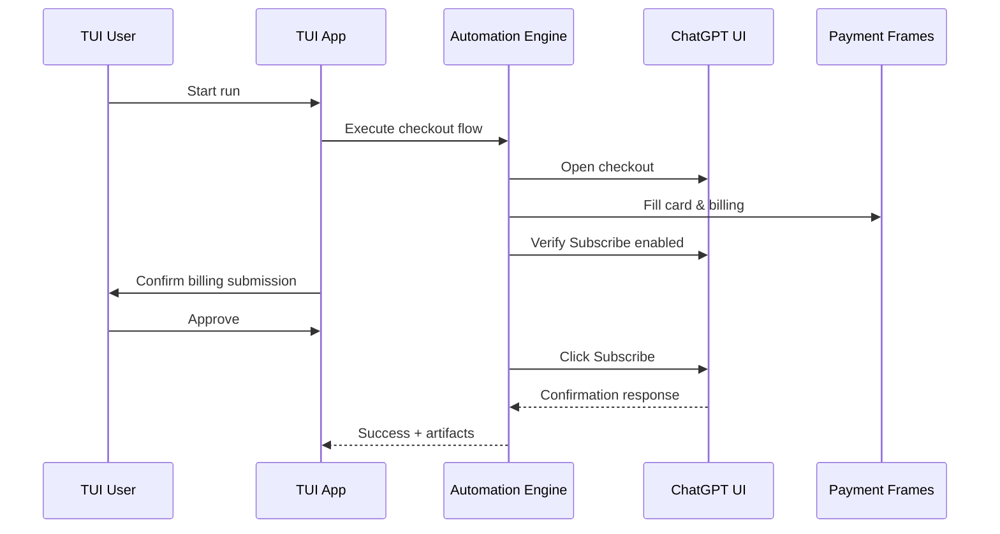
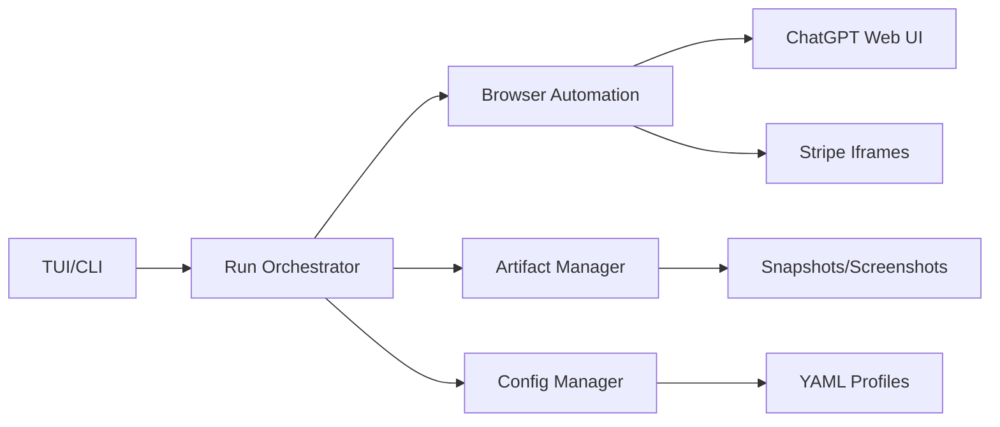
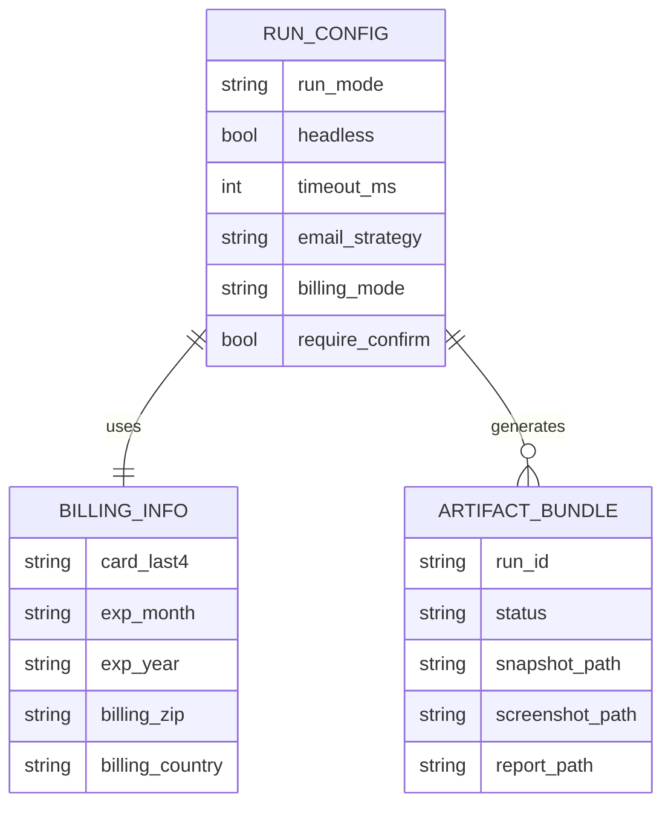

# TUI-First Product Design for Trial Provisioning

**Goal:** Provide a polished, user-friendly TUI (with future CLI + web monitoring) for QA/Ops to execute end-to-end ChatGPT business trial provisioning, including real billing submission with strict auditing.

**Audience:** QA automation engineers, Ops teams.

**Tech Stack (initial):**
- Node.js (existing automation stack)
- Inquirer/Ink (TUI), blessed/consola (logs)
- chrome-devtools-mcp (browser control)
- YAML config + JSON artifact bundles
- OS keychain integration (optional encrypted storage)

---

## User Stories

- **QA Engineer:** “I need a repeatable, audited trial flow that runs headless, captures artifacts, and flags UI changes.”
- **Ops Lead:** “I need to provision multiple trial accounts in batch with configurable billing settings and explicit approvals.”
- **Security Reviewer:** “I need to ensure sensitive billing data is not stored unless explicitly requested.”
- **Support Engineer:** “I need a clear artifact bundle when a run fails, including snapshots and screenshots.”

---

## Configuration Model (TUI + YAML)

Configurable sections:
- **Run Mode:** Single / Batch
- **Execution:** Headless on/off, timeouts, retry policy
- **Identity:** Email provisioning strategy, OTP timeout
- **Plan Selection:** Business/Team, seat count, billing cadence
- **Billing:** Card number, exp, CVC, address, consent mode
- **Safety:** Pre-submit checkpoints, dry-run mode
- **Artifacts:** Screenshot/snapshot retention, export bundle

---

## Mermaid Diagrams

### 1) TUI Flow (Flowchart)

### 2) State Machine (Execution States)

### 3) Sequence Diagram (Checkout Submission)

### 4) Architecture Diagram

### 5) Data Model (Config & Artifacts)

---

## UX Notes

- **Guided Wizard:** Each section is editable and previewed before execution.
- **Sensitive Data Handling:** Masked inputs, in-memory by default, explicit opt-in to store.
- **Checkpoint Prompts:** Required before billing submission.
- **Exportable Reports:** JSON + HTML summary with redacted billing details.

---

## Next Steps (If Approved)

- Finalize UX flow and screen mockups.
- Implement TUI skeleton (Ink or blessed).
- Integrate config validation + artifact exports.
- Add real billing form-filling guardrails and confirmations.
